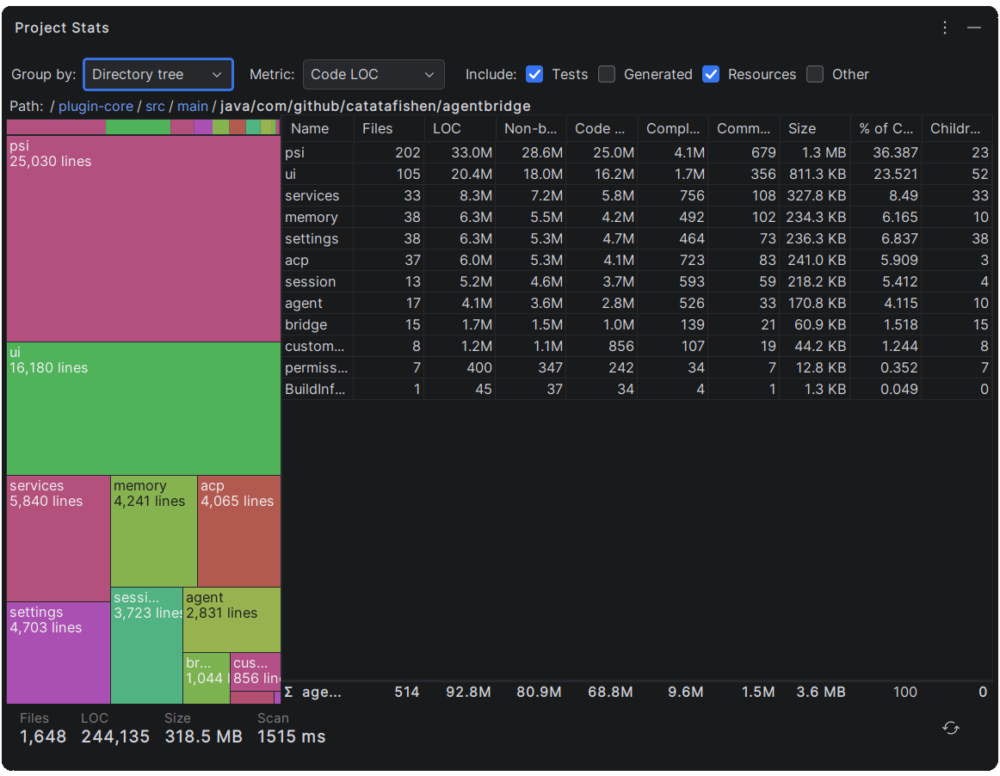

# Project Stats — IntelliJ Plugin

A JetBrains plugin that visualizes where your project's source code comes from — broken down by language, module,
category, or directory, with multiple metrics and interactive visualizations.

## Features

### Groupings

Choose how to slice your project in the **Group by** dropdown:

| Option | Description |
|---|---|
| **Language** | Groups files by IntelliJ file type (Kotlin, Java, TypeScript, XML, …) |
| **Module** | Groups by IntelliJ module |
| **Source category** | Groups by classification: Sources, Tests, Resources, Test Resources, Generated, Other |
| **Directory tree** | Hierarchical drill-down — double-click a tile or row to go deeper, breadcrumb to navigate back |

### Metrics

Select what value is measured and visualized in the **Metric** dropdown:

| Metric | Description |
|---|---|
| **Total LOC** | All lines including blank lines and comments |
| **Non-blank LOC** | Lines that contain at least one non-whitespace character |
| **Code LOC** | Non-blank, non-comment lines |
| **Complexity** | Cyclomatic complexity (branching statements) |
| **File size** | Raw file size in bytes (displayed as B / KB / MB / GB) |
| **File count** | Number of files |
| **Commits** | Number of git commits touching each file |

### Filters

Toggle which file categories are included via the **Include** checkboxes in the toolbar:

| Filter | Default | What it controls |
|---|---|---|
| **Tests** | ✅ on | Test source roots (JUnit, pytest, etc.) |
| **Resources** | ✅ on | Resource and test-resource roots |
| **Generated** | ☑ off | Files under generated source roots |
| **Other** | ✅ on | Files not matched by any other category |

Filters apply instantly — no re-scan needed.

### Visualizations

All three views update simultaneously when you change grouping, metric, or filters:

- **Stacked bar** — GitHub-style proportional bar showing the percentage share of each bucket at a glance.
- **Treemap** — Squarified treemap with stable per-language colors, value tooltips, and drill-down support
  (double-click to enter, breadcrumb or back button to exit). Layout is cached; only recomputed on data or size change.
- **Sortable table** — Shows each bucket's name, file count, Total LOC, Non-blank LOC, Code LOC, file size, share %,
  and child count. Click any column header to sort. Large numbers are displayed compactly (e.g. `32.9K`).
  Sorting uses the raw numeric value, so ordering is always correct.

### Summary KPIs

The footer always shows totals for the current filter state:

- **Files** — total file count
- **LOC** — total line count
- **Size** — total size (auto-scaled to B / KB / MB / GB)
- **Scan** — time taken for the last scan

### Scanning

- Runs in the background with a progress indicator and a cancel button.
- Large-file guard: files over 4 MiB are counted by size only (no LOC counting).
- Uses IntelliJ's `ProjectFileIndex`, `GeneratedSourcesFilter`, and JPS `JavaSourceRootType` for authoritative
  source-root classification, and `VirtualFile` charsets for accurate line counts.
- Git commit counts are read from `git log --follow` per file when git is available.

## Build & contributing

See [BUILDING.md](BUILDING.md).

## Releases & security

See [RELEASES.md](RELEASES.md) and [SECURITY.md](SECURITY.md).

## License

Apache License 2.0 — see [LICENSE](LICENSE) and [NOTICE](NOTICE).
